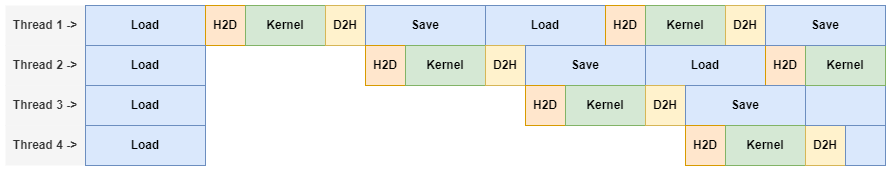
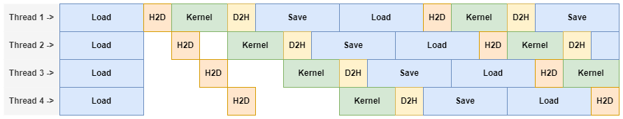
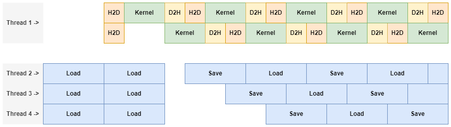

<br />
<p align="center">
  <h1 align="center">Generalized Convolution Operators</h1>

  <p align="center">
    A fast distributed GPU-based convolution algorithm using CUDA, MPI and pthreads.
  </p>
</p>

## About The Project

Common image processing operators such as Gaussian blurring, certain edge detectors, dilations and erosions can all be expressed as convolutions. Performing convolutions on large image data sets takes a significant amount of time. To improve the performance of these operators, parallelization strategies can be employed. We propose GenConv: a framework that can run in a distributed setup and makes use of CUDA to perform convolution operators on the GPU. It provides the ability to do convolutions, dilations and erosions. The programmer can chain and customize these operations in any way they see fit. Some examples on a very small image can be seen below.

|| |  ||
|:--:| :--: | :--: | :--: |
| *Original* | *Gaussian blur* | *Dilation* | *Erosion* |

## Acknowledgements

This project was created in collaboration with [Albert Dijkstra](https://github.com/RUGAlbert). He worked on large parts of the job file parsing and MPI structure.

## Getting Started

To get a local copy up and running follow these simple steps.

### Prerequisites

You need to the following to be able to compile and run the project

* [Make](https://www.gnu.org/software/make/)
* [CUDA](https://developer.nvidia.com/cuda-toolkit)
* [MPI](https://www.open-mpi.org/)

### Setup

To set up the program, run the following commands:
```sh
    git clone git@github.com:BugelNiels/distributed-gpu-convolution.git
    cd distributed-gpu-convolution
```

### Compilation

The compilation is done via Make:
```sh
make
```

The makefile takes two optional argumens:
```sh
make RELEASE=1
```
Will create a release build of the program. The default is a debug build.
```sh
make KERNEL_SCRIPT=processingScripts/processing.cu
```
This will set the processing script to use to be `src/cuda/processingScripts/processing.cu`. This is useful for when multiple scripts are present and you want to switch between them on consecutive runs. Note that only one processing script can be used at the time.

All of these optional arguments can be used at the same time.

### Running

#### SLURM

To run the program on a slurm cluster you can look at one of the `benchmark.sh` scripts for inspiration. Provided the configuration is correct, you can use:

```sh
srun ./conv job.txt outputdir
```

#### Single Machine

You can run the project on a single machine as follows

```sh
mpirun -np 1 ./conv job.txt outputDir
```

Alternatively it can also be run without MPI:

```sh
./conv job.txt outputDir
```

# Job Files

GenConv uses a custom format job file that contains some basic information about the type of images that is received and which images to process. The file follows the following format:
```
3
8
256 256
0 0
inputimages/readme/image1.pgm
inputimages/readme/image2.pgm
inputimages/readme/image3.pgm
```
The first line indicates the number of images to process. The second line states the number of bits used for each pixel (the dynamic range). The third line indicates the maximum dimensions any given image in the job can have. The fourth line indicates how many pixels are padded on the side of each dimension. Next are all the images that should be processed.

> As of now, only `.pgm` images are supported. The implementation was done in such a way that the addition of additional image formats is very straightforward.

# Kernels

The application supports very simple convolution kernel formats. These follow the following format:
```
3 3
0 1 0
1 -4 1
0 1 0
```
The first line indicates the `width`x`height` of the kernel. Next are `height` lines with on each line `width` elements of the kernel.

# Making Changes to the Processing Steps

The processing steps the programming does is defined in `src/cuda/processingScripts/processing.cu`. You can either alter this file or add a new file and pass this file as a make argument.

Image processing is often a matter of connecting small lego blocks in any way that your use case sees fit. This is impossible to do via a configuration system without significant performance penalties. As such, it is up to the programmer to define the sequence of operations they want to do. A very basic understanding of CUDA is required to achieve optimal performance here.

When making changes to the script, the `cudaConfig.h` in `src/configs` should be updated accordingly. In particular the maximum kernel dimensions. CUDA needs to know this, because constant memory cannot be dynamically allocated at runtime.

Ideally, the only two places the programmer ever needs to change things is in their processing script and a slight update to the `cudaConfig.h` to accomodate for any kernels they might use.

# Splitter & Combiner

The application also compiles to additional executables: `splitter` and `combiner`. The `splitter` can be used to either split a single image into multiple smaller tiles (optionally with padding). The `combiner` can be used to combine tiles into a single image again. Note that the combiner requires the input tiles to follow the same naming convention as the tiles generated by the splitted.

# How Does It Work

The program takes a `job.txt` and `outputDir` as inputs. Every node in the distributed system read the total number of images to process from the `job.txt` file and calculate from this which images to process. This is possible, because each node knows the total number of nodes and its own index in the node group. 

## Processing: Single Node
Now that each node has a list of images to process, it passes on this list to the CUDA part of the application. Before the processing can start, a setup step is required. In this setup step, the convolution kernels (not to be confused with the CUDA kernels) are loaded (using a custom .kernel format) and buffers are allocated for the images on both the device (GPU) and host (CPU). The host memory is allocated as page-locked memory to improve the speed of the copies from and to the device. Page-locked memory ensures that the memory cannot be paged out by the operating system, which means the transfers can be done using DMA without the involvement of the CPU. This is significantly faster than memory that is not page-locked.

The buffers are only allocated once and reused for each image, since the allocation (and freeing) of page-locked memory and device memory is rather expensive. The overhead of setting up the device and allocating memory is quite large. Consequently, it is preferable for a single node to process multiple images to reduce the relative overhead.

The structure of processing a single image is roughly as follows:

1. Read image to buffer `B`
2. Copy contents of buffer `B` to the GPU
3. Process image on the GPU
4. Copy result from the GPU back to buffer `B`
5. Save the image stored in buffer `B`

### Parallel IO

The timeline for processing two images looks as follows:


The order in which the images are processed is not relevant. Additionally, images do not depend on each other. Consequently, we can easily parallelise the processing steps by using multiple CPU threads:



### Hiding Latency With CUDA Streams

Modern (NVIDIA) GPUs have three separate queues: one Copy Engine for copying from Host to Device (H2D), one Copy Engine for copying from Device to Host(D2H) and one Compute Engine queue for the kernels. Any CUDA calls issued to these queues from the same stream are executed in the order that they arrived in. However, this means that 2 of the 3 engines are idling whenever a CUDA call is being executed.

We can use multiple CUDA streams to reduce the amount of idling of the different engines. Each stream is created on a separate thread to ensure that the saving and loading does not unnecessarily block the execution of the other streams. Using multiple streams on seperate threads helps in hiding some of the latency incurred by the copy engines:



### Asynchronous IO

We can improve this even further by using seperate threads for reading and writing and a single main thread that enqueues all the CUDA calls. For this to work, all calls on the main thread should be asyncronous. Luckily, all CUDA calls are already asyncronous w.r.t. the host code, so all that is left is to create asyncronous IO. This is done via seperate read and write threads.

A number of stacks are used that can be used by the main thread to handle loaded images and save requests. The read/write threads can then determine to load an image:

1. Pop from the buffer stack
2. Load an image into the buffer
3. Push buffer into the load stack

or it can determine to save an image:

1. Pop a buffer from the save stack
2. Save the image from the buffer
3. Push the buffer back into the buffer stack.

All the main thread does is then:

1. Pop buffer from the load stack
2. Copy contents of buffer to the GPU
3. Process image on the GPU
4. Copy result from the GPU back to buffer
3. Push buffer into the save queue

This process is considerably faster than the previous approaches, as it makes better use of the available CPU cores. The whole process using 4 threads, 2 CUDA streams and 6 buffers looks roughly as follows:



> Note that this presents an idealized scenario, which is not entirely accurate. In reality, the async IO approach is roughly twice as fast as the basic parallel IO with CUDA streams approach.

## Processing: Single Image

In the GPU implementation of convolution, each thread is responsible for a single pixel in the output image. 
Each thread loops over the elements in the convolution kernel and calculates the final value that the output pixel should have depending on the "type" of convolution performed. 

In the naive implementation the input image, output image and convolution kernel are stored in global memory. In this case, the Compute to Global Memory Access ratio is very poor. Each thread performs `2 * P * Q + 1` global memory accesses where `P` and `Q` are the width and height of the kernel. Consequently, the CUDA program will be memory bound as global memory accesses are incredibly expensive.

> For those not familiar with the GPU memory architecture of CUDA compatible devices, there are (roughly-speaking) four different read/writes a thread can do: on global memory, on shared memory, on registers and on constant memory. The time it takes to access these different memory structures is important to understand when writing CUDA kernels. Global memory access takes **\~500** clock cycles, shared memory takes **\~5**  clock cycles, register access takes **\~1** clock cycle and constant memory takes **\~5** clock cycles. Global memory is local to a grid. Shared memory is local to a thread block, registers are local to a thread and constant memory is local to a grid. Note that the constant memory is generally very small (64KB in most modern machines).

Using this information, we can calculate that each thread spends roughly `(2 * P * Q + 1) * 500 = 1000 * P * Q + 500` clock cycles on memory accesses. Luckily, this can be improved significantly.

### Tiled 2D Convolution

There are two ways in which the latency from the memory accesses can be reduced. The first is by storing the convolution kernel in constant memory. The second way is by splitting the (output) image into multiple tiles. Each tile has the size of a thread block. Each thread in the block then loads 1 element (or more if the input image is padded) into shared memory. Once all the threads in a block are finished with copying the data to shared memory, the actual convolution part algorithm can be performed. 

Using these two strategies, we have significantly reduced the number of global memory reads. Each thread does 2 global memory accesses (reading input pixel and writing output pixel), `P * Q + 1` shared memory accesses and `P * Q` constant memory accesses. In total this results in roughly `(2 * P * Q + 1 ) * 5 + 2 * 500 = 10 * P * Q + 1005 `. This is significantly less than the `1000 * P * Q + 500` clock cycles of the naive implementation.

The tiled convolution algorithm has a lot more aspects that make it relatively complex and it would take quite a bit more text to explain fully. A good resource that contains some more details about the strategy can be found [here](https://www.cs.ucr.edu/~nael/217-f15/lectures/217-lec8.pdf). It should be noted that their strategy spawns 1 thread for every pixel in the input image instead of per pixel in the output image. 

As a final note, this tiling strategy has its limitations. As the kernel dimensions grow, two things can happen: the convolution kernel might not fit in constant memory anymore and the shared memory might spill into global memory. Ultimately, the strategy is sufficient for the large majority of use cases, since kernel sizes of up to `200 \times 200` should still work. For larger convolution kernels, alternative strategies could be used, such as convolution in the frequency domain or seperating the kernel into 2 1D kernels if possible. 
